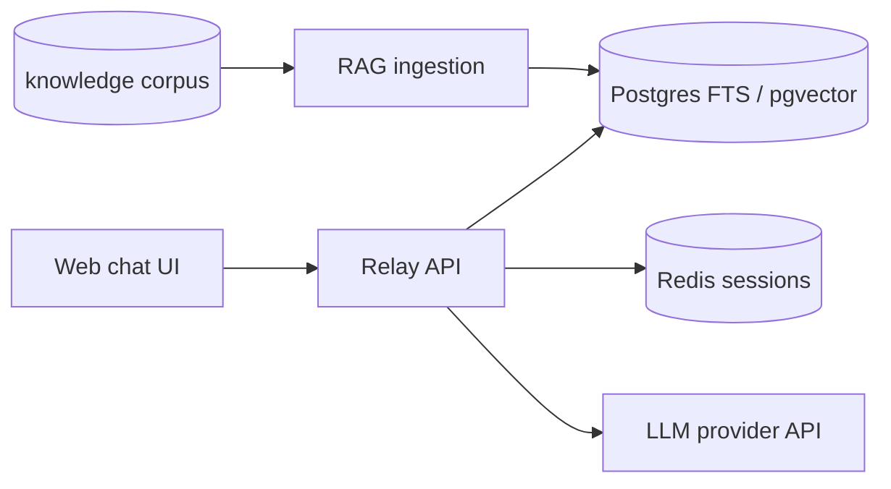

# Relay

Local-first conversational internal developer portal: cited Q&A, platform-service registry, and draft-and-route actions.

License: [BSD 3-Clause](LICENSE)

Contributing: [CONTRIBUTING.md](CONTRIBUTING.md) (PR workflow + Conventional Commits, aligned with [repave](https://github.com/opsdevcode/repave))

## Quick start

No API keys required — answers use **extractive mode** from the bundled docs.

```bash
make up          # creates .env from .env.example if missing, starts stack, auto-indexes
make ci          # ruff + mypy + bandit + pip-audit + pytest (host; same gates as CI)
open http://localhost:3000
make smoke       # HTTP end-to-end check (stack must be running)
make verify      # unit tests in container + smoke
```

Optional: set `ANTHROPIC_API_KEY` in `.env` for synthesized LLM answers instead of extractive excerpts.

**Local testing** is a first-class deliverable: [docs/local-testing.md](docs/local-testing.md).

API: http://localhost:8080 · Health: http://localhost:8080/health

To index a custom markdown tree, add `deploy/docker-compose.override.yml` (see `deploy/docker-compose.override.example.yml`).

## Repo layout

```text
apps/
  relay-assistant/      # FastAPI: chat, RAG, tools
  web/                  # Static chat UI (Backstage plugin comes later)
packages/
  platform-services/    # Registry: knowledge + tools + views per capability
knowledge/
  corpus/               # Bundled sample docs (proposals, standards, docs)
  sources.yaml          # Ingestion config
templates/
  k8s-service/          # Golden-path: containerized service (any managed K8s)
deploy/
  docker-compose.yml
  k8s/base/             # Portable K8s (no cloud CRDs)
  k8s/overlays/         # aks | eks | gke — ingress/LB annotations only
catalog/entities/       # Seed catalog-info.yaml for demo
docs/
```

## Architecture (working model)



Draft-and-route: mutating tools return a **draft**; the UI requires explicit confirmation before any GitHub action runs.

## Conversational surfaces

| Surface | Status |
| --- | --- |
| **Web** (embedded chat) | Working model — `apps/web/` |
| **Microsoft Teams** | Planned — bot adapter on Relay API |
| **Slack** | Planned — bot adapter on Relay API |

Backstage (phase 2) embeds the web chat; Teams and Slack reuse the same backend with channel-specific adapters.

## Kubernetes portability

| Concern | Base manifest | Cloud overlay |
| --- | --- | --- |
| Ingress | Generic `networking.k8s.io/v1` | Class + annotations per cloud |
| Secrets | K8s Secret / External Secrets pattern | ESO + cloud secret store |
| Identity | None (add OIDC at ingress) | Cognito / Google IAP / corporate IdP |
| Storage | `standard` StorageClass | Set per cluster in overlay |
| Images | GHCR (`ghcr.io/opsdevcode/...`) | Same — any registry |

See [docs/kubernetes.md](docs/kubernetes.md) · [docs/security-governance.md](docs/security-governance.md) · [docs/local-testing.md](docs/local-testing.md) · **[docs/roadmap.md](docs/roadmap.md)** (full plan)

## Status

| Phase | Scope |
| --- | --- |
| **Next** | Phase 1: hybrid RAG, Backstage slice, Redis sessions (1A.1 registry routing done) |
| **Now** | Phase 0 demo hardening complete (corpus, UX, demo-api, demo script, CI) |
| **Later** | Governed actions at scale, Teams/Slack, managed K8s, platform-service v2/v3 |

Details, milestones, and work item IDs: **[docs/roadmap.md](docs/roadmap.md)**.

## Releases

Version tags (`vX.Y.Z`) and GitHub Releases are automated from
[Conventional Commits](https://www.conventionalcommits.org/) on `main` via
[python-semantic-release](https://python-semantic-release.readthedocs.io/).
See [CONTRIBUTING.md](CONTRIBUTING.md) for commit types, semver bumps, and the
`RELAY_RELEASE_TOKEN` secret.
