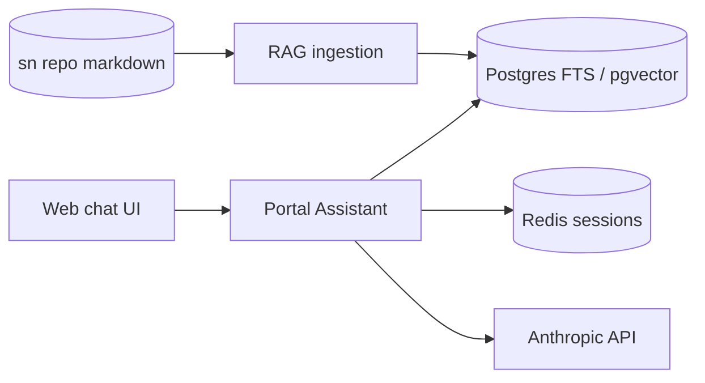

# AI Developer Portal — Working Model

Local-first implementation of the [conversational internal developer portal](https://github.com/opsdevcode/sn/tree/main/proposals/ai-developer-portal) proposal.

**Local now:** `docker compose up` runs Postgres, Redis, the Portal Assistant API, and a web chat UI.

**Kubernetes later:** manifests under `deploy/k8s/` use standard resources only (Deployment, Service, Ingress, ConfigMap, Secret). Cloud-specific bits (AWS ALB, Azure Front Door, GKE Gateway) live in optional overlays — not in the base.

## Quick start

```bash
cp .env.example .env
# Optional: set ANTHROPIC_API_KEY for live chat synthesis

# Point at your local clone of the sn proposals repo (knowledge corpus)
export KNOWLEDGE_PATH=/path/to/sn

make up
make ingest    # index markdown from KNOWLEDGE_PATH
open http://localhost:3000
```

API: http://localhost:8080 · Health: http://localhost:8080/health

## Repo layout

```text
apps/
  portal-assistant/     # FastAPI: chat, RAG, tools, LangGraph (phase 2)
  web/                  # Static chat UI (Backstage plugin comes later)
packages/
  platform-services/    # Registry: knowledge + tools + views per capability
  rag-ingestion/        # Index knowledge sources into Postgres
templates/
  k8s-service/          # Golden-path: containerized service (any managed K8s)
deploy/
  docker-compose.yml
  k8s/base/             # Portable K8s (no cloud CRDs)
  k8s/overlays/         # aks | eks | gke — ingress/LB annotations only
catalog/entities/       # Seed catalog-info.yaml for demo
knowledge/sources.yaml  # What to index
docs/
```

## Architecture (working model)



Draft-and-route: mutating tools return a **draft**; the UI requires explicit confirmation before any GitHub action runs.

## Kubernetes portability

| Concern | Base manifest | Cloud overlay |
| --- | --- | --- |
| Ingress | Generic `networking.k8s.io/v1` | Class + annotations per cloud |
| Secrets | K8s Secret / External Secrets pattern | ESO + cloud secret store |
| Identity | None (add OIDC at ingress) | Entra / Cognito / Google IAP |
| Storage | `standard` StorageClass | Set per cluster in overlay |
| Images | GHCR (`ghcr.io/opsdevcode/...`) | Same — any registry |

See [docs/kubernetes.md](docs/kubernetes.md).

## Status

| Phase | Scope |
| --- | --- |
| **Now** | Local compose, FTS RAG over `sn`, cited chat, platform-service registry |
| **Next** | LangGraph tools, golden-path PR scaffold, Backstage backbone |
| **Later** | Managed K8s deploy, Foundry/AI Search swap-in, Teams bot |
