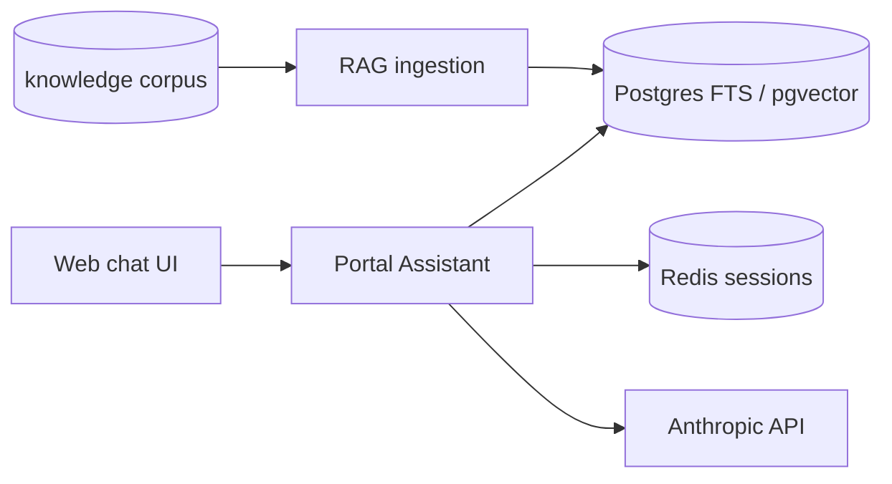

# AI Developer Portal — Working Model

Local-first conversational internal developer portal: cited Q&A, platform-service registry, and draft-and-route actions.

## Quick start

```bash
cp .env.example .env
# Optional: set ANTHROPIC_API_KEY for live chat synthesis

make up
make ingest    # indexes bundled knowledge/corpus by default
open http://localhost:3000
```

API: http://localhost:8080 · Health: http://localhost:8080/health

Override the knowledge tree by setting `KNOWLEDGE_PATH` in `.env` to any directory of markdown you want indexed.

## Repo layout

```text
apps/
  portal-assistant/     # FastAPI: chat, RAG, tools
  web/                  # Static chat UI (Backstage plugin comes later)
packages/
  platform-services/    # Registry: knowledge + tools + views per capability
knowledge/
  corpus/               # Bundled sample docs (proposals, standards, docs)
  sources.yaml          # Ingestion config
templates/
  k8s-service/          # Golden-path: containerized service (any managed K8s)
deploy/
  docker-compose.yml
  k8s/base/             # Portable K8s (no cloud CRDs)
  k8s/overlays/         # aks | eks | gke — ingress/LB annotations only
catalog/entities/       # Seed catalog-info.yaml for demo
docs/
```

## Architecture (working model)



Draft-and-route: mutating tools return a **draft**; the UI requires explicit confirmation before any GitHub action runs.

## Kubernetes portability

| Concern | Base manifest | Cloud overlay |
| --- | --- | --- |
| Ingress | Generic `networking.k8s.io/v1` | Class + annotations per cloud |
| Secrets | K8s Secret / External Secrets pattern | ESO + cloud secret store |
| Identity | None (add OIDC at ingress) | Entra / Cognito / Google IAP |
| Storage | `standard` StorageClass | Set per cluster in overlay |
| Images | GHCR (`ghcr.io/opsdevcode/...`) | Same — any registry |

See [docs/kubernetes.md](docs/kubernetes.md).

## Status

| Phase | Scope |
| --- | --- |
| **Now** | Local compose, FTS RAG, cited chat, platform-service registry, Actions-only scaffold |
| **Next** | LangGraph tools, Backstage backbone |
| **Later** | Managed K8s deploy, Foundry/AI Search swap-in, Teams bot |
