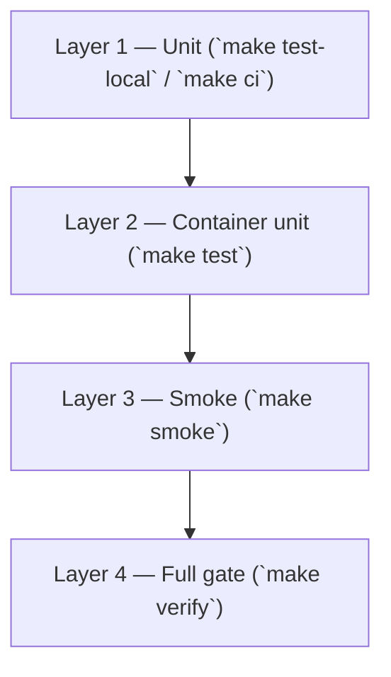

# Local testing

Local testing is a **first-class deliverable** for this repository. Anyone cloning the repo should be able to validate behavior on a laptop **without cloud accounts, API keys, or production services**.

**Quick gate**

```bash
make ci          # unit tests only — works offline after Python 3.12 + pip install
make up          # start stack (no keys)
make verify      # unit tests in container + HTTP smoke against localhost:8080
```

See also: [local-setup.md](local-setup.md) · [roadmap.md](roadmap.md)

---

## Why local testing matters

| Audience | What they need |
| --- | --- |
| **Contributors** | Fast feedback before opening a PR |
| **Reviewers** | Reproducible checks, not “works on my machine” |
| **Demos** | Proof the portal runs with zero secrets |
| **Platform teams** | Contract tests for draft-and-route and RAG before pilot envs exist |

Production pilots add identity, managed databases, and observability backends. **Local testing must stay runnable without those dependencies.**

---

## Test layers



### Layer 1 — Unit tests (no Docker)

Runs pytest against pure Python modules: chunking, extractive answers, scaffold normalization, confirm payload shape.

```bash
# Same command GitHub Actions runs on every PR
make ci

# Equivalent
cd apps/portal-assistant && PYTHONPATH=src python3 -m pytest -q
```

**Requirements:** Python 3.11+ (3.12 recommended), `pip install -e "./apps/portal-assistant[dev]"`.

**No API keys.** No Postgres. No Redis.

### Layer 2 — Unit tests in container

Runs the same suite inside the image used by `portal-assistant` — catches packaging/path issues.

```bash
make up
make test
```

### Layer 3 — Smoke (HTTP end-to-end)

`scripts/smoke-local.sh` exercises the running stack on `http://localhost:8080`:

| Step | Validates |
| --- | --- |
| `GET /health` | OK status, `api_keys_required: false`, documents indexed |
| `POST /chat` | Extractive Q&A over bundled corpus |
| `GET /platform-services` | Registry loaded |
| `POST /actions/confirm` | Scaffold confirm with **chat-shaped draft** (`inputs.service_name`) |

```bash
make up    # wait until healthy
make smoke
```

Override API base: `API=http://127.0.0.1:8080 make smoke`.

### Layer 4 — Verify (pre-commit / pre-PR gate)

```bash
make up
make verify    # `make test` then `make smoke`
```

Use **`make verify`** before pushing changes that touch the assistant, ingestion, or smoke script.

---

## CI parity

| Local | GitHub Actions |
| --- | --- |
| `make ci` | [`.github/workflows/ci.yml`](../.github/workflows/ci.yml) on push/PR to `main` |

CI runs **Layer 1 only** so PRs stay fast and do not require Docker in the runner for the default gate.

Optional future job: compose-up + `make smoke` on `main` or nightly (heavier).

---

## Adding tests with new behavior

Every change to portal behavior should extend local testing in the same PR:

| Change type | Required testing |
| --- | --- |
| New tool or draft shape | Unit test for draft + confirm; extend smoke if HTTP-facing |
| RAG / ingest | Unit test for chunking/search helpers; smoke if default answers change |
| Registry entry | Test that registry loads (smoke already checks one ID) |
| Web UI only | Manual check in browser; prefer a small JS test or smoke note in PR |

**Scaffold example:** `test_confirm_scaffold_draft_uses_chat_draft_shape` ensures confirm reads `inputs.service_name` from drafts returned by `/chat` — the same JSON the web UI posts on Confirm.

---

## Troubleshooting

**`make ci` — No module named pytest**

```bash
pip install -e "./apps/portal-assistant[dev]"
```

**`make test` — service not running**

```bash
make up
docker compose -f deploy/docker-compose.yml ps
```

**`make smoke` — API unreachable**

- Confirm port 8080 is free and `portal-assistant` container is healthy.
- `docker compose -f deploy/docker-compose.yml logs portal-assistant`

**`make smoke` — documents: 0**

- Wait a few seconds after startup for auto-ingest, or run `make ingest`.

**Fresh database**

```bash
make down
docker volume rm deploy_postgres_data 2>/dev/null || true
make up
make smoke
```

---

## Acceptance criteria (local testing deliverable)

We treat local testing as **done for a release** when all of the following hold:

- [ ] `make ci` passes on a clean clone with only Python 3.12 + pip install (documented in README).
- [ ] `make smoke` passes after `make up` with no `.env` API keys.
- [ ] CI workflow runs `make ci` on every PR to `main`.
- [ ] [roadmap.md](roadmap.md) Phase 0 items for testing (0.6, 0.7) stay green or are superseded by stricter gates.
- [ ] New features ship with tests per the table above.

---

## Related Makefile targets

| Target | Purpose |
| --- | --- |
| `make bootstrap` | Create `.env` from example if missing |
| `make up` / `make down` | Start/stop compose stack |
| `make ingest` | Re-index knowledge corpus |
| `make ci` | Unit tests (CI + local fast path) |
| `make test-local` | Same as `make ci` |
| `make test` | Unit tests inside container |
| `make smoke` | HTTP smoke tests |
| `make verify` | Container unit + smoke |
