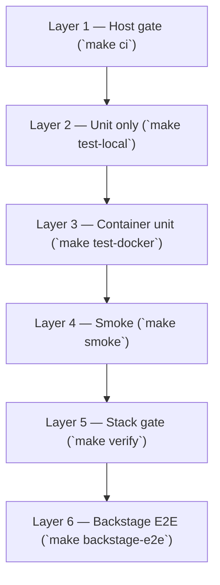

# Local testing

Local testing is a **first-class deliverable** for this repository. Anyone cloning the repo should be able to validate behavior on a laptop **without cloud accounts, API keys, or production services**.

**Quick gate**

```bash
make install     # pip install -e apps/relay-assistant[dev]
make ci          # quality + security + unit tests (matches CI jobs on host)
make up          # start stack (no keys)
make verify      # unit tests in container + HTTP smoke
```

See also: [local-setup.md](local-setup.md) · [local-compose.md](local-compose.md) · [corpus-pipeline.md](corpus-pipeline.md) · [tdd.md](tdd.md) · [roadmap.md](roadmap.md) · [CONTRIBUTING.md](../CONTRIBUTING.md)

---

## Test-driven development

Use **red → green → refactor** for new behavior: write a failing pytest, Jest, or
E2E assertion first, implement, then run `make ci` and stack/browser checks. Full
workflow, examples, and PR checklist: **[tdd.md](tdd.md)**.

---

## Why local testing matters

| Audience | What they need |
| --- | --- |
| **Contributors** | Fast feedback before opening a PR |
| **Reviewers** | Reproducible checks, not “works on my machine” |
| **Demos** | Proof the portal runs with zero secrets |
| **Platform teams** | Contract tests for draft-and-route and RAG before pilot envs exist |

Production pilots add identity, managed databases, and observability backends. **Local testing must stay runnable without those dependencies.**

---

## Test layers



### Layer 1 — Host CI gate (no Docker)

Runs the same checks as GitHub Actions quality, security, and test jobs:

```bash
make ci    # make quality && make security && make test-local
```

Includes Ruff, mypy, Bandit, pip-audit, and pytest.

### Layer 2 — Unit tests only

```bash
make test-local
```

**Requirements:** Python 3.11+ (3.12 recommended), `make install` or `pip install -e "./apps/relay-assistant[dev]"`.

**No API keys.** No Postgres. No Redis.

### Layer 3 — Unit tests in container

```bash
make up
make test-docker
```

### Layer 4 — Smoke (HTTP end-to-end)

`scripts/smoke-local.sh` exercises the running stack on `http://localhost:8080`:

| Step | Validates |
| --- | --- |
| `GET /health` | OK status, `api_keys_required: false`, hybrid retrieval, documents indexed |
| `POST /chat` | Extractive Q&A over bundled corpus; response includes `citations` with `title` |
| `POST /internal/reindex` | **503** when `INGEST_WEBHOOK_SECRET` is unset (local default) |
| `GET /platform-services` | Registry loaded |
| `POST /actions/confirm` | Scaffold confirm with **chat-shaped draft** (`inputs.service_name`) |

When you add or change HTTP behavior, **update this script in the same PR** (TDD:
extend smoke in the red step, then implement). See [tdd.md](tdd.md).

```bash
make up    # wait until healthy
make smoke
```

Override API base: `API=http://127.0.0.1:8080 make smoke`.

### Layer 5 — Verify (pre-push)

```bash
make up
make verify    # `make test-docker` then `make smoke`
```

Use **`make verify`** before pushing changes that touch the assistant, ingestion, or smoke script.

### Layer 6 — Backstage Playwright E2E

`apps/backstage/packages/app/e2e-tests/` (Playwright). Locally, `make backstage-e2e`
starts the app on **:3001** and backend **:7007** if not already running.

```bash
make backstage-install   # once
make backstage-e2e
```

Update Playwright specs when catalog UX or guest login flow changes. Catalog seed
entities (Relay, CloudOpt) are covered by `catalog-seed.test.ts`.

---

## CI parity

| Local | GitHub Actions |
| --- | --- |
| `make test-local` | `ci.yml` → job **test** |
| `make quality` | `python-quality-security.yml` → **Code quality (Ruff + mypy)** |
| `make security` | `python-quality-security.yml` → **Security (Bandit + pip-audit)** |
| PR title + commits | `conventional-commits.yml` → **semantic-pull-request**, **commitlint** |
| `make ci` | All of the above on the host (before opening a PR) |
| `make backstage-test` | `backstage.yml` → **test** (when `apps/backstage/**` or `catalog/entities/**` change) |

Docs-only PRs skip heavy steps via `.github/actions/ci-paths/` but checks still report success (required for rulesets). See [CONTRIBUTING.md](../CONTRIBUTING.md).

Playwright E2E is **local / pre-push** (`make backstage-e2e`); not required in CI yet
(startup cost). Unit + contract tests gate Backstage PRs in CI.

---

## Adding tests with new behavior

**TDD:** write the failing test first, then implement. **Every feature and fix**
ships **unit tests and E2E updates** in the same PR.

| Change type | Unit (red/green first) | E2E (same PR) |
| --- | --- | --- |
| New tool or draft shape | Draft + confirm pytest | Extend `scripts/smoke-local.sh` if HTTP-facing |
| RAG / ingest / corpus pipeline | `test_ingest.py`, helpers | Smoke chat/citations/reindex when contracts change |
| Registry entry | `test_registry.py` | Smoke already checks `golden-path-scaffold` |
| Catalog / Backstage config | `test_catalog_entities.py`, `test_backstage_config.py` | `e2e-tests/*.ts`; `make backstage-e2e` |
| New API route | `TestClient` pytest | New smoke step |
| Web UI only (`apps/web/`) | Prefer small test or contract doc | Manual or future browser test; note in PR |
| Bug fix | Regression pytest/Jest that failed before fix | Update smoke/Playwright if symptom was E2E-only |

**Scaffold example:** `test_confirm_scaffold_draft_uses_chat_draft_shape` ensures confirm reads `inputs.service_name` from drafts returned by `/chat` — the same JSON the web UI posts on Confirm. Smoke repeats the confirm call against a running stack.

**Backstage:** `make backstage-test` (Jest) in CI; `make backstage-e2e` (Playwright) before push when UI changes.

More detail: [tdd.md](tdd.md).

---

## Troubleshooting

**`make ci` — No module named pytest**

```bash
pip install -e "./apps/relay-assistant[dev]"
```

**`make test` — service not running**

```bash
make up
docker compose -f deploy/docker-compose.yml ps
```

**`make smoke` — API unreachable**

- Confirm port 8080 is free and `relay-assistant` container is healthy.
- `docker compose -f deploy/docker-compose.yml logs relay-assistant`

**`make smoke` — documents: 0**

- Wait a few seconds after startup for auto-ingest, or run `make ingest`.

**Fresh database**

```bash
make down
docker volume rm deploy_postgres_data 2>/dev/null || true
make up
make smoke
```

---

## Acceptance criteria (local testing deliverable)

We treat local testing as **done for a release** when all of the following hold:

- [ ] `make ci` passes on a clean clone with only Python 3.12 + pip install (documented in README).
- [ ] `make smoke` passes after `make up` with no `.env` API keys.
- [ ] `make ci` passes locally before every PR.
- [ ] CI workflows `test`, quality, security, commitlint, and semantic PR checks pass on `main`.
- [ ] [roadmap.md](roadmap.md) Phase 0 items for testing (0.6, 0.7) stay green or are superseded by stricter gates.
- [ ] New features ship with **unit + E2E** tests per [tdd.md](tdd.md) and the table above.

---

## Related Makefile targets

| Target | Purpose |
| --- | --- |
| `make bootstrap` | Create `.env` from example if missing |
| `make up` / `make down` | Start/stop compose stack (portal) |
| `make up-backstage` / `make down-backstage` | Stack + Backstage compose profile |
| `docker compose up --build -d` | Same as `make up` — [local-compose.md](local-compose.md) |
| `make ingest` | Re-index knowledge corpus (upsert) |
| `make ingest-full` | Delete all docs then re-index (drops stale chunks) |
| `make install` | Install dev dependencies (`apps/relay-assistant[dev]`) |
| `make ci` | Quality + security + unit tests (host) |
| `make test-local` | Pytest only (host) |
| `make test-docker` | Pytest inside container |
| `make quality` | Ruff + mypy |
| `make security` | Bandit + pip-audit |
| `make smoke` | HTTP smoke tests (`scripts/smoke-local.sh`) |
| `make verify` | Container unit + smoke |
| `make backstage-test` | Backstage Jest unit tests |
| `make backstage-e2e` | Backstage Playwright E2E |
