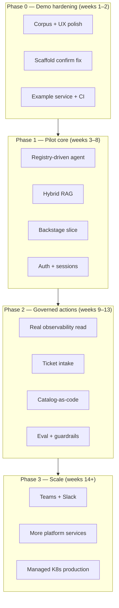

# Relay — Roadmap

This document is the execution roadmap for the **working model** in this repository and the path to a **pilot-ready internal developer portal (IDP)**. It consolidates product phases, platform-service expansion, and engineering milestones in one place.

**Related docs:** [local-setup.md](local-setup.md) · [local-testing.md](local-testing.md) · [tdd.md](tdd.md) · [corpus-pipeline.md](corpus-pipeline.md) · [scaffolding.md](scaffolding.md) · [kubernetes.md](kubernetes.md) · [security-governance.md](security-governance.md)

---

## Vision

Developers **talk to the platform** instead of hunting wikis, repos, and consoles. The portal provides:

- **Grounded answers** with citations from indexed standards, runbooks, and catalog metadata.
- **Guided actions** that **draft and route** — scaffold PRs, ticket-system requests, observability lookups — with **explicit human confirmation** before anything mutates.
- **Extensibility** via a **platform-service registry**: each capability registers knowledge sources, tools, and views without re-architecting the assistant.

The working model proves the pattern locally with **no API keys required**. Production adds identity, richer RAG, Backstage as catalog backbone, and org-specific integrations.

---

## Principles (locked for this repo)

| Principle | Implication |
| --- | --- |
| **Draft-and-route** | The assistant never applies production change directly; it prepares drafts for PR or ticket workflows. |
| **No secrets in the app** | GitHub Actions uses the built-in `GITHUB_TOKEN` in CI; the portal returns workflow links, not PATs. |
| **Local-first demo** | `make up` must work with zero model keys (extractive RAG default). |
| **Local testing first-class** | `make ci` (no Docker) and `make verify` (stack + smoke) are documented deliverables; **TDD**: unit + E2E tests in the same PR ([tdd.md](tdd.md)). |
| **Pluggable models** | Optional LLM synthesis via a thin client (`apps/relay-assistant/src/portal_assistant/llm.py`); no vendor-specific agent runtime required in this repo. |
| **Portable K8s** | Base manifests are cloud-neutral; overlays only adjust ingress/LB annotations. |
| **Registry-driven growth** | New platform capabilities onboard by extending `packages/platform-services/registry.yaml` and wiring tools — not by fork-lifting the agent. |

---

## Current state (baseline)

What ships in this repo today:

| Area | Status | Notes |
| --- | --- | --- |
| Local stack | Done | Postgres (FTS + pgvector extension), Redis, Relay API, web UI |
| RAG | Done (FTS) | Auto-ingest on startup; bundled `knowledge/corpus/` (**15** sample docs) |
| Answer modes | Done | Extractive (default); optional Anthropic API for synthesis |
| Chat intents | Done | Regex routing: Q&A, services list, scaffold, sandbox, mock health |
| Scaffold action | Done | Draft → confirm → GitHub Actions workflow dispatch link |
| Sandbox action | Done | Draft → confirm → GitHub issue template link |
| Platform registry | Done (YAML) | Four services declared; **registry-driven routing** (1A.1) |
| K8s manifests | Done (base) | Portal web + assistant; no in-cluster DB/corpus yet |
| Local testing | Done (baseline) | `make ci`, `make smoke`, `make verify`; see [local-testing.md](local-testing.md) |
| CI / PR workflow | Done | Repave-style workflows + ruleset JSON + [CONTRIBUTING.md](../CONTRIBUTING.md) |
| Backstage | Done (1C.1) | `apps/backstage` imports `catalog/entities/catalog.yaml` (guest auth; port 3001) |
| Teams / Slack | Planned | Same API; adapters not built |
| Semantic RAG | Done (hybrid baseline) | Local hash embeddings + FTS RRF in Postgres/pgvector |
| Corpus pipeline | Done (1B.2) | Filesystem + optional `type: git`; `make ingest-full`; `POST /internal/reindex` |
| Redis sessions | Done (working model) | Thread id in `/chat`; history in Redis; scaffold name follow-ups |
| Auth | Not started | Open API in local demo |
| Real observability | Not started | `service_health` returns mock data |

Run **`make ci`** anytime (no stack). After **`make up`**, run **`make smoke`** or **`make verify`** — see [local-testing.md](local-testing.md).

---

## Semver releases vs roadmap

Three different “version” ideas appear in planning — keep them separate:

| Term | Meaning | Example |
| --- | --- | --- |
| **Phase 0 / 1 / 2 / 3** | Timeboxed delivery phases in this doc | Phase 1 = pilot core |
| **Registry `v1` / `v2` / `v3`** | Platform-service maturity tier in `registry.yaml` | `developer-sandbox` is **v2** |
| **`vX.Y.Z` Git tag** | [Semver](https://semver.org/) for the **`relay-assistant`** Python package | [GitHub Releases](https://github.com/opsdevcode/relay/releases) |

Package versions are **not** chosen in the roadmap. They are computed on merge to `main` from
[Conventional Commits](https://www.conventionalcommits.org/) via
[python-semantic-release](https://python-semantic-release.readthedocs.io/) (see
[CONTRIBUTING.md](../CONTRIBUTING.md)): `feat:` → minor, `fix:` → patch, breaking → major.
The Release workflow publishes the tag, updates `apps/relay-assistant/CHANGELOG.md`, and bumps
`__version__` in `apps/relay-assistant/src/portal_assistant/__init__.py`.

### Mapping (milestones ↔ tags)

Use this table to align **roadmap milestones** with **observed or target** semver. Update the
**Shipped** rows when a release is published; adjust **Target** rows when scope changes.

| Git tag | Shipped | Roadmap milestone | What it represents |
| --- | --- | --- | --- |
| **v1.0.0** | 2026-07-24 | **M0** (Phase 0) | First release: local stack, Phase 0 demo hardening, CI/release automation on `main`. |
| **v1.1.0** | 2026-07-24 | **M0** (Phase 0) | Product rename to **Relay**; paths `relay-assistant` / `relay-web`; no new Phase 1 scope. |
| **v1.2.0+** | Target (1A.1 landed on `main`) | **M1** start (Phase 1) | Registry-driven agent; next minors track hybrid RAG, Backstage slice, sessions. |
| **v2.0.0** | Target | **M2** (Phase 2) | Reserved for **breaking** deploy or API changes when **v1 pilot complete** (governed actions, auth, real observability). Only required if integrators must change config or contracts. |
| **v2.x / v3.0.0** | Target | **M3** (Phase 3) | Org rollout: Teams/Slack, production K8s ops, broader registry; major bump only if breaking. |

**Phase 0 exit (M0 checklist)** is satisfied by behavior on `main`, not by a specific tag — but
**≥ v1.0.0** marks the first packaged baseline. Maintainers may run **`make verify`** before
tagging (optional gate; see M0 below).

**Registry tiers (`v1` / `v2` / `v3`)** do not map 1:1 to semver majors. A **v2** platform
service (e.g. sandbox) can ship in a **1.x** package release once its tool handler exists.

---

## Roadmap overview

Timelines are indicative for a small platform squad; adjust for design-partner availability and org gates (Security, Legal, identity).

---

## Phase 0 — Demo hardening (MVP 1.1)

**Goal:** Make the public working model credible for leadership and design-partner conversations without production dependencies.

**Target:** 1–2 weeks.

### Work items

| ID | Work | Exit criteria | Repo touchpoints |
| --- | --- | --- | --- |
| 0.1 | Fix scaffold confirm payload | UI confirm passes the same `service_name` the user asked for | `scaffold.py`, `tools.py`, web confirm flow — **done** |
| 0.2 | Expand knowledge corpus | ≥ 15 indexed docs covering onboarding, GitOps, tagging, golden path, SLO basics | `knowledge/corpus/`, `knowledge/sources.yaml` — **done** |
| 0.3 | Web UX polish | Markdown rendering, suggested prompt chips, clickable citations | `apps/web/` — **done** |
| 0.4 | Committed scaffold example | `examples/services/demo-api/` generated from template | template + workflow or manual seed — **done** |
| 0.5 | Demo script | 5-minute presenter walkthrough | `docs/demo-script.md` — **done** |
| 0.6 | PR CI | `make ci` on every PR | `.github/workflows/ci.yml` — **done** |
| 0.7 | Integration test | Chat-shaped draft → confirm preserves `inputs.service_name` | `tests/test_scaffold.py` — **done** |

### Milestone M0: Demo-ready

- [ ] `make ci` passes on a clean clone (Python 3.12 + `pip install -e "./apps/relay-assistant[dev]"`).
- [ ] `make smoke` passes on a fresh clone with no `.env` API keys after `make up`.
- [ ] `make verify` passes before release tags (optional local gate for maintainers).
- [ ] Live demo: Q&A with citation → list services → scaffold named service → workflow link shows correct inputs.
- [ ] README, [local-testing.md](local-testing.md), and demo script match actual behavior.

---

## Phase 1 — Pilot core

**Goal:** Backstage-backed catalog, better retrieval, and multi-turn chat suitable for 2–3 design-partner teams in non-prod.

**Target:** weeks 3–8 (parallel workstreams).

### Workstream 1A — Agent and registry

| ID | Work | Exit criteria |
| --- | --- | --- |
| 1A.1 | Registry-driven tool dispatch | Intents and tool metadata loaded from `registry.yaml`; adding a registry entry is the primary extension path — **done** |
| 1A.2 | Structured tool graph | Write tools run through `run_chat_graph` with draft-only guard — **done** |
| 1A.3 | Redis sessions | Thread ID + short history; follow-up refinement (“call it payments-api”) — **done** |
| 1A.4 | Registry UI | Sidebar or cards from `/platform-services` with “try this” prompts — **done** (web loads `prompts` from registry) |

### Workstream 1B — RAG

| ID | Work | Exit criteria |
| --- | --- | --- |
| 1B.1 | Hybrid retrieval | Embeddings at ingest + FTS rank fusion in Postgres/pgvector — **done** (local embedder; swap in prod) |
| 1B.2 | Corpus pipeline | Documented ingest from Git (standards repo, doc-as-code output); re-index job or webhook — **done** (`docs/corpus-pipeline.md`, git sources, `POST /internal/reindex`, `make ingest-full`) |
| 1B.3 | Metadata | Frontmatter (title, owner, updated); better chunk titles |
| 1B.4 | Pluggable LLM client | Same interface for Anthropic, Azure OpenAI, or local model — org chooses in deploy config, not in this repo’s defaults |

**Model note:** This repo does **not** require Microsoft Foundry or any single cloud AI product. Production deploy repos supply endpoints and secrets (Key Vault / ESO). Local dev stays extractive-first.

### Workstream 1C — Backstage

| ID | Work | Exit criteria |
| --- | --- | --- |
| 1C.1 | Minimal Backstage app | Catalog imports `catalog/entities/` — **done** (`apps/backstage`, `app-config.yaml` file location) |
| 1C.2 | Embedded chat | iframe or plugin pointing at portal web UI / API |
| 1C.3 | TechDocs | At least one entity with published docs from repo markdown |
| 1C.4 | Scaffolder registration | Golden-path template registered; aligns with Actions workflow |

See `apps/backstage/README.md` for bootstrap notes.

### Workstream 1D — Identity (non-prod pilot)

| ID | Work | Exit criteria |
| --- | --- | --- |
| 1D.1 | OIDC at ingress | Unauthenticated access disabled outside local compose |
| 1D.2 | User context in API | Subject + groups passed to retrieval (prep for ABAC) |
| 1D.3 | Confirm action authorization | Only entitled users can confirm mutating drafts |

### Milestone M1: Design-partner alpha

- [ ] Partners use Backstage + chat in non-prod with SSO.
- [ ] Hybrid RAG improves recall on paraphrased questions vs FTS-only baseline.
- [ ] New platform service can be added via registry + one tool module without editing core agent regex.

---

## Phase 2 — Governed actions and trust

**Goal:** v1 production posture: real observability read, ticket handoff, catalog-as-code at scale, and measurable answer quality.

**Target:** weeks 9–13.

### Workstream 2A — Actions

| ID | Work | Exit criteria |
| --- | --- | --- |
| 2A.1 | Golden-path scaffold PR | Workflow opens PR under agreed path; includes `catalog-info.yaml` stamp |
| 2A.2 | Ticket system handoff | Replace sandbox issue stub with ServiceNow/Jira (or org standard) via approved integration |
| 2A.3 | Risk-tier aware drafts | PR templates respect CODEOWNERS / change tiers documented in knowledge corpus |
| 2A.4 | Audit log | Prompt, retrieval sources, tool calls, confirm events persisted and queryable |

### Workstream 2B — Observability

| ID | Work | Exit criteria |
| --- | --- | --- |
| 2B.1 | Real `service_health` | Read-only query or deep link to Grafana for cataloged services |
| 2B.2 | Embedded view | `grafana-embed` view type in registry backed by real URL template |
| 2B.3 | SLO summary in chat | Burn rate / alert count from metrics backend (not mock) |

### Workstream 2C — Catalog-as-code

| ID | Work | Exit criteria |
| --- | --- | --- |
| 2C.1 | GitHub discovery | Processor ingests `catalog-info.yaml` from in-scope org repos |
| 2C.2 | Ownership resolution | “Who owns X?” answers from catalog, not only docs |
| 2C.3 | On-call linkage | Optional integration to paging/on-call API |

### Workstream 2D — Safety and quality

| ID | Work | Exit criteria |
| --- | --- | --- |
| 2D.1 | ABAC on retrieval | Filter chunks by visibility + user groups |
| 2D.2 | Groundedness eval set | Fixed Q&A set run in CI; threshold gate on PRs |
| 2D.3 | Injection defenses | Tool allow-list, output moderation, kill switch documented and tested |
| 2D.4 | Citation-required mode | LLM answers rejected in eval if sources missing |

### Milestone M2: v1 pilot complete

- [ ] Design partners complete real tasks: scaffold, sandbox request, observability question, standards Q&A.
- [ ] No mutating action executes without confirm + governed downstream path.
- [ ] Eval gate passes on main; Security sign-off on tool allow-list and RAG sources.

---

## Phase 3 — Scale and platform breadth

**Goal:** Default entry point for developers; more capabilities via registry; production K8s operations.

**Target:** weeks 14+ and rolling 90-day increments.

### Surfaces

| ID | Work | Exit criteria |
| --- | --- | --- |
| 3.1 | Microsoft Teams bot | Bot adapter → same Relay API |
| 3.2 | Slack bot | Same API; shared session model |
| 3.3 | Streaming responses | SSE/WebSocket for chat UX |

### Platform services (expansion phases)

Capabilities onboard through the registry using three contribution types:

- **Knowledge** — docs/runbooks indexed for RAG.
- **Tools** — draft-and-route actions (PR or ticket).
- **Views** — catalog tabs, embedded dashboards, scorecards.

| Expansion phase | Theme | Example capabilities |
| --- | --- | --- |
| **v1 — Know + read** | Answer and insight | Standards Q&A, catalog/ownership, observability read, policy citations |
| **v2 — Act** | Self-service with approval | Sandbox provisioning, artifact approvals, runner/VM requests, tag remediation PRs |
| **v3 — Deep** | Graphs and maturity | Infra dependency graph, compliance scorecards, DR drill automation, cost/FinOps views |

Each new capability should ship: registry entry, knowledge paths (if any), tool handler, view stub or embed, and a row in the demo/eval set.

### Production Kubernetes

| ID | Work | Exit criteria |
| --- | --- | --- |
| 3.4 | Managed Postgres + corpus sync | Assistant starts with non-empty index in cluster |
| 3.5 | Ingestion job | Cron or init job; versioned corpus from object storage or Git |
| 3.6 | Image publish workflow | GHCR tags per release; no `:latest` in prod overlays |
| 3.7 | GitOps deploy | Live env repo points at `deploy/k8s/overlays/<cloud>` |
| 3.8 | Portal SLOs | OTel traces, RED metrics, confirm funnel dashboards |

### Milestone M3: Org rollout ready

- [ ] Teams or Slack in pilot alongside web.
- [ ] ≥ N platform services registered with at least one tool or view each (org-defined N).
- [ ] Production cluster meets security baseline in [security-governance.md](security-governance.md).

---

## Platform-service registry — onboarding checklist

When adding a capability (edit `packages/platform-services/registry.yaml` and implement wiring):

1. **Register** — `id`, `name`, `description`, `phase` (`v1` / `v2` / `v3`).
2. **Routing** — add a `routing:` rule (regex `patterns`) or rely on `docs_search` default for Q&A-only tools.
3. **Knowledge** — list corpus sources or paths; ensure `knowledge/sources.yaml` includes them.
4. **Tools** — implement handler in `portal_assistant.tools.dispatch_tool`; register id in `REGISTERED_TOOL_IDS`.
5. **Tool kind** — declare `kind: read|write` under `tools:`; write tools require `requires_confirmation: true`.
6. **Views** — declare `techdocs`, `scaffolder`, `grafana-embed`, or `catalog`; implement in Backstage or web as appropriate.
7. **Tests** — intent or API test + eval question if RAG-backed (`tests/test_registry.py` validates YAML).
8. **Docs** — one paragraph in corpus or `docs/` describing when to use the capability.

Current registered services (working model):

| ID | Phase | Tools | View types |
| --- | --- | --- | --- |
| `knowledge-standards` | v1 | `docs_search` | techdocs |
| `golden-path-scaffold` | v1 | `scaffold_service` | scaffolder |
| `developer-sandbox` | v2 | `request_sandbox` | catalog |
| `observability-insight` | v1 | `service_health` | grafana-embed |

---

## Dependencies

| Dependency | Phases | Mitigation |
| --- | --- | --- |
| Identity provider (OIDC/Entra/Okta) | 1D+ | Start with ingress-level auth; expand to group claims for ABAC |
| GitHub org settings | 0, 2A | Workflow permissions, branch protection, template repos |
| Metrics stack (Grafana/Prometheus) | 2B | Read-only API token in deploy secret; mock until available |
| Ticket system API | 2A | Issue template stub remains until integration approved |
| Design-partner time | 1–2 | 2–3 teams committed for alpha/pilot |
| Legal/model approval | 1B, 2D | Extractive-only path requires no model approval; LLM optional per env |

---

## Risks and mitigations

| Risk | Impact | Mitigation |
| --- | --- | --- |
| Thin corpus → weak Q&A | High | Phase 0 corpus expansion; doc-as-code pipeline in Phase 1B |
| Hallucination in LLM mode | High | Citations required; eval gate; extractive default; read-heavy v1 |
| Registry drift (YAML vs code) | Medium | Phase 1A registry-driven dispatch; CI check for orphaned tools |
| Scaffold/confirm bugs | High | Phase 0.1 + integration tests |
| Retrieval over-sharing | High | ABAC in Phase 2D; visibility metadata at ingest |
| Cost of embeddings/LLM | Medium | Hybrid RAG caching; cheap routing for classify/summarize; showback |

---

## KPIs (suggested)

| Checkpoint | Metric |
| --- | --- |
| Phase 0 | Smoke + CI green; demo script completed once by someone outside core team |
| Phase 1 | ≥ 80% of design-partner “how do I” questions answered with citation from indexed corpus |
| Phase 2 | Scaffold PR opened in < 10 minutes from confirm; observability query returns live data for pilot services |
| Phase 3 | Weekly active chat users among pilot teams; confirm→success rate for scaffold and sandbox |

---

## How this doc stays current

- Update **Current state** when milestones land on `main`.
- Update **Semver releases vs roadmap** (shipped tag rows and dates) when a GitHub Release is published.
- Add rows to phase tables when scope changes; do not delete completed items — mark done with date in PR description.
- Keep README **Status** table as a one-line summary linking here:

  `See [docs/roadmap.md](roadmap.md) for the full plan.`

---

## Quick reference — what to build next

Recommended order after Phase **1C.1**:

1. Phase **1B.3** Metadata — frontmatter (title, owner, updated); better chunk titles
2. Phase **1C.2** Embedded chat — iframe or plugin pointing at portal web UI / API

Phase **1A.***, **1B.1–1B.2**, and **1C.1** (minimal Backstage catalog) are on `main`.
Chat flow: refine → route → execute → write guard (`portal_assistant.graph`).
Tool `kind: read|write` lives under `tools:` in `registry.yaml`.
Corpus ops: [corpus-pipeline.md](corpus-pipeline.md).
Backstage: [`apps/backstage/README.md`](../apps/backstage/README.md).
